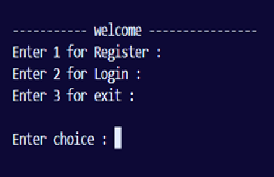

# Login & Registration System

A console-based Login and Registration System developed in C++ using Object-Oriented Programming (OOP) and File Handling.

## Features
- User Registration
- User Login
- Username Validation
- Password Validation
- Input Validation
- File Handling using CSV
- Persistent User Data Storage

## Technologies Used
- C++
- OOP
- File Handling
- VS Code
- Git & GitHub

## Project Structure

├── main.cpp
├── user.cpp
├── user.h
├── userDetails.csv
├── README.md
└── .gitignore

## How to Run

1. Open the project in VS Code.
2. Compile the source files.
3. Run the executable.
4. Register a new user.
5. Login using the registered credentials.

## Future Improvements

- Password Encryption
- Forgot Password
- Account Lock after Multiple Failed Attempts
- Admin Panel
- Database Integration

## Author
Atul Pandey

